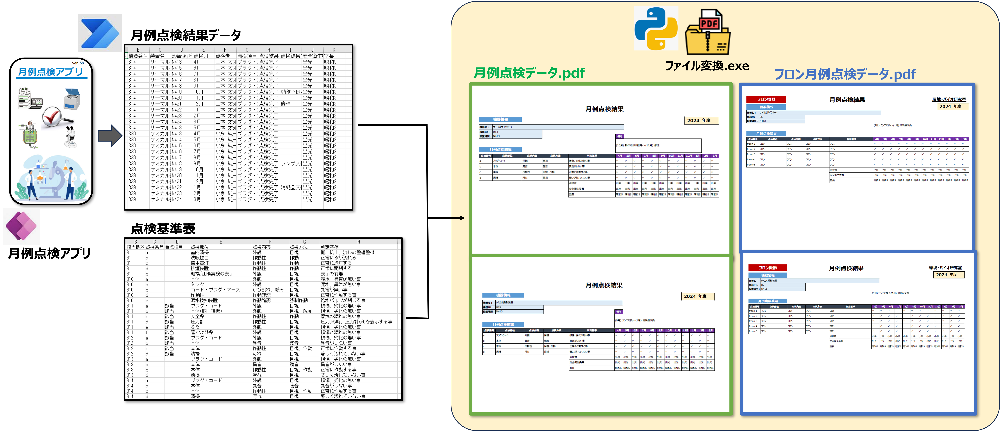

# 月例点検データの変換ツール

## 環境構築
(1) Conda環境設定

`conda create -n geturei python`

`conda activate geturei`

(2) モジュールインストール

`pip install pandas`

`pip install openpyxl`

`pip install pywin32`

`pip install pypdf`

`pip install pyinstaller`

## exeファイル作成

「Exe作成」フォルダに`transform_data.py`を保管し、以下のコマンドを実行

`pyinstaller transform_data.py --onefile --noconsole --name ファイル変換 --icon image.ico`

## 実行方法

- 「ファイル名の登録」/ファイル名情報.xlsxを開き、ファイル名と出力先パスを入力

- Monthly-inspection-data-transform内に「月例点検データ」、「点検基準表」を保存

- ファイル変換.exeを実行

